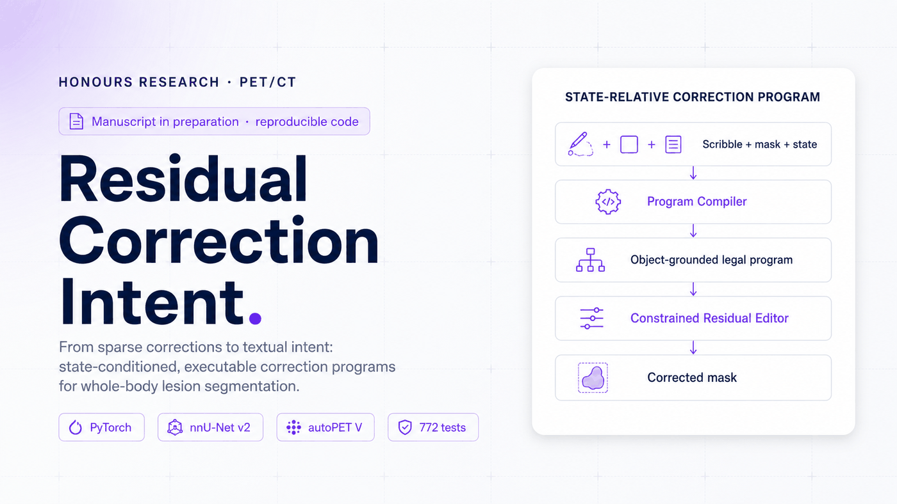
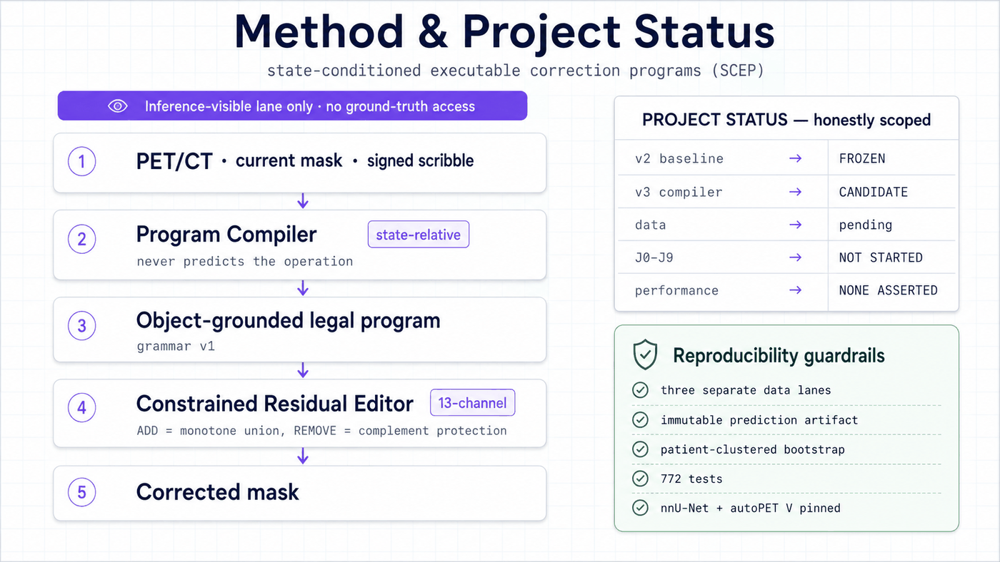

<div align="right"><a href="README.md">English</a></div>

<p align="center"></p>

**Residual Correction Intent** 是 Honours 毕业论文 *"From Sparse Corrections to Textual Intent: State-Relative PET/CT Residual Correction"* 的研究代码，研究用于交互式全身 PET/CT 病灶分割的 **state-conditioned executable correction programs（SCEP）**。它要解决的问题狭窄而具体：在预测掩码（mask）上画下的一笔稀疏涂鸦只说明**在哪里**（where）需要修正，却没有说明该编辑**哪个对象**（which object）、该执行**哪种操作**（which operation）。本仓库由 **Ruixuan Liao**（悉尼大学 Honours 研究者，同时也是三篇 2026 年医学影像与特征选择方向同行评审期刊论文的合著者）撰写，定位是一份可审计的研究代码。

## ✨ 亮点

- **意图，而不仅是位置** —— 涂鸦标出编辑应发生在何处；编译器负责解析它真正指向的*哪个对象*与*哪个操作数*。
- **状态相对的程序编译器** —— 它选择对象与操作数，但**从不预测操作（operation）**；操作的依据来自提示（cue）的符号。
- **一套小而合法的文法（grammar v1）** —— 每个生成的程序都取自 `GROW_LOCAL` / `COMPLETE` / `CREATE_NEW` / `TRIM` / `DELETE` / `REPAIR`。
- **受约束的残差编辑** —— 一个 13 通道（13-channel）编辑器，其中 `ADD` 为单调并集（monotone union），`REMOVE` 施加硬补集保护（hard complement protection）。
- **从构造上保证可复现** —— 三条物理隔离的数据通道、一个不可变的预测工件（immutable prediction artifact）、防泄漏的数据划分、一份 SHA-256 清单，以及按 commit 固定的依赖。
- **充分测试** —— 772 个测试函数守护上述各项契约。

## 🏗 方法

<p align="center"></p>
<p align="center"><sub>完整的 inference-visible 通道，旁边并列展示本项目诚实界定的进展状态与可复现性护栏。</sub></p>

该方法把交互式修正中通常被混为一谈的三件事分开：用户所指的**位置**、该位置所属的**对象**，以及应当施加于它的**操作**。涂鸦只提供了第一件。编译器以**状态相对（state-relative）**的方式解析第二件 —— 读取当前掩码与状态，并且在这条通道上的任何环节都**不访问 ground-truth** —— 同时刻意不去解析第三件，因为操作已由提示（cue）的符号决定。由此产出的是一个面向对象、且符合文法的合法程序；只有该程序才被允许支配这次残差编辑，从而让编辑保持有界，而不是让网络自由地重写掩码。

1. **输入** —— PET/CT、当前掩码，以及一笔带符号的涂鸦（signed scribble）。
2. **Program Compiler**（状态相对） —— 选择对象与操作数并生成程序；它从不预测操作。
3. **面向对象的合法程序** —— 一个 grammar-v1 程序：`GROW_LOCAL` / `COMPLETE` / `CREATE_NEW` / `TRIM` / `DELETE` / `REPAIR`。
4. **Constrained Residual Editor**（13 通道） —— 在护栏下施加编辑：`ADD` = 单调并集，`REMOVE` = 硬补集保护。
5. **输出** —— 修正后的掩码。

## 🔬 可复现性与护栏

- **三条物理隔离的数据通道** —— inference-visible / label-only / evaluation-only。
- **不可变的预测工件** —— 在评估**之前**写入，因此预测无法被调向指标（metric）。
- **防泄漏的评估** —— 按病人聚类的 bootstrap，以及防泄漏的数据划分。
- **完整性清单** —— 对受追踪工件的一份 SHA-256 清单。
- **固定的依赖** —— nnU-Net v2 与 autoPET V 均按 commit 固定。
- **数据集** —— PSMA-PET/CT，597 例 / 378 位病人，CC BY-NC 4.0。

## 🧰 技术栈

| 领域 | 技术 |
| --- | --- |
| 语言 | Python 3.10 |
| 深度学习 | PyTorch（torch 2.6）、nnU-Net v2 |
| 科学计算 | NumPy、nibabel、SciPy |
| 数据 | PSMA-PET/CT（597 例 / 378 位病人，CC BY-NC 4.0） |

## 🚀 快速开始

本仓库更适合作为**可审计的研究代码**（auditable research code）来阅读，而不是一条命令即可复现的项目。完整的训练与评估环境 —— CUDA、内置（vendored）的 nnU-Net 目录树、autoPET V 包，以及受许可的数据集 —— **无法在原始机器之外运行**。你在本地*可以*运行的，是守护这些契约的测试与静态检查（lint）：

```bash
python -m pytest -q tests
python -m ruff check scripts tests
```

## 🧪 测试

```bash
python -m pytest -q tests
```

该套件包含 **772 个测试函数**，用于强制执行上文所述的数据通道隔离、文法合法性以及残差编辑护栏。

## 📌 局限与范围

这是一项进行中的研究，因此已经确立的范围被刻意保持得很窄。最重要的一点是：**本仓库不主张任何性能结果** —— 这里的内容都不应被解读为该方法能提升分割质量的证据。各个部分的进展如下：

| 部分 | 当前状态 |
| --- | --- |
| v2 六分类基线 | 已冻结，逐字节一致（byte-identical） |
| v3 程序编译器 | 经过审计的实现候选 |
| 数据物化（materialisation） | 等待一份独立回执（independent receipt） |
| J0–J9 实验 | 尚未开始 |
| 性能结果 | 无，未作任何主张 |

一篇手稿正在准备中。

## 📄 许可证

LICENSE 将随手稿发布一同提供；在此之前代码为 **all rights reserved（保留所有权利）**，且目前尚无 `LICENSE` 文件。数据集（PSMA-PET/CT）以 **CC BY-NC 4.0** 许可，本仓库不对其进行再分发。

<p align="center"><sub>Built by <a href="https://github.com/SensLiao">Ruixuan "Sens" Liao</a> · USYD Advanced Computing (Honours)</sub></p>
