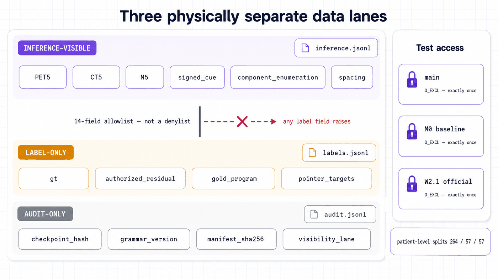

<div align="right"><a href="README.md">English</a></div>

<p align="center"></p>

<p align="center">
  
  
  
  
</p>

**Residual Correction Intent** 是荣誉学位论文 *"From Sparse Corrections to Textual Intent: State-Relative PET/CT Residual Correction"* 的研究代码，作者 **Ruixuan Liao**（悉尼大学）。它研究面向交互式全身 PET/CT 病灶分割的**状态条件可执行修正程序（SCEP）**，并且是按**可审计研究代码**的标准写的：方法中的每一条契约——语法合法性、数据泳道隔离、编辑护栏——都由机器可校验的代码和测试执行，而不是靠文字承诺。

<p align="center">
  <a href="#-方法">方法</a> ·
  <a href="#-可复现性与护栏">可复现性</a> ·
  <a href="#-数据集">数据集</a> ·
  <a href="#-你能运行什么">运行测试</a> ·
  <a href="#-引用">引用</a>
</p>

## 🧭 概览

**问题。** 在交互式分割中，画在预测掩膜上的一笔稀疏涂鸦说明了**哪里**需要修正——但没有说明该编辑**哪个对象**，也没有说明该执行**哪种操作**。现有系统把三者混为一谈：同一笔涂鸦可能意味着"把这个病灶局部长大"、"补全这个欠分割的病灶"或"这里有个新病灶"，而一个自由重绘的网络只能一边改掩膜一边猜。

**方案。** SCEP 把三个问题拆开，各自在正确的位置回答。涂鸦提供*位置*。一个**状态相对的程序编译器**——读取 PET/CT、当前掩膜与涂鸦，**在这条泳道中任何位置都无法访问 ground truth**——解析出*对象*与操作数，并刻意拒绝解析*操作*：操作的权威仅来自笔画的符号（正笔画只能 `ADD`，负笔画只能 `REMOVE`；极性含糊时代码直接抛错而不是猜）。产物是一个对象锚定、语法合法的程序，且只有这个程序被允许支配一次**受约束的残差编辑**——编辑因此保持有界，而不是任由网络自由重绘。

**范围。** 本仓库是进行中论文研究的可审计核心：契约、配置、schema、构建器、训练/评估入口，以及执行这一切的测试套件。它**不主张任何性能结果**——这里没有任何内容应被解读为该方法提升分割质量的证据（验证性实验 J0–J9 已注册、未启动）。完整训练环境——CUDA、vendored 的 nnU-Net 树、autoPET V 包、需授权的数据集——无法在原机器之外运行；任何机器上都能跑的是测试与契约。

## 📌 贡献（以代码形式呈现）

1. **修正意图的状态相对表述**：把一次稀疏修正分解为*位置*（涂鸦）、*对象*（从当前状态编译得出）与*操作*（由笔画符号导出，永不预测）。
2. **小而合法的修正语法（v1）** — 六个程序族，schema 强制执行，非法组合在结构上不可表示（如 `ADD_NEW_LOCAL` 是被禁止的联合目标，无操作数的 `PREDICT` 无法通过校验）。
3. **13 通道受约束残差编辑器**，其执行代数在构造上有界：`ADD` 只能增（`prediction AND NOT current`），`REMOVE` 只能在选定组件内减，补集永远受保护。
4. **构造性可复现** — 三条物理隔离的数据泳道、不可变预测工件、恰好一次的测试集访问台账、258 条目的 SHA-256 清单、commit 级 pin 的依赖。
5. **91 个文件、778 个测试函数**，把以上全部作为可执行契约来强制。

## 🔬 方法

<p align="center"></p>
<p align="center"><sub>端到端的推理可见泳道，旁边是项目的诚实状态与可复现护栏。</sub></p>

推理可见泳道，逐步走一遍：

1. **输入** — PET 与 CT 上下文切片、当前掩膜、带符号的涂鸦（`FG_POSITIVE` 或 `BG_NEGATIVE`）。
2. **程序编译器**（状态相对，17 通道输入）— 从可见状态确定性地枚举候选组件，打分并把涂鸦**绑定**到一个对象，经固定的类型化轨迹发出程序：`OBSERVE → ENUMERATE → SCORE → BIND → TYPECHECK → PROTECT → EXECUTE`。它也可以**弃权（abstain）**，而不是发出非法程序。
3. **对象锚定、语法合法的程序** — 六个族之一（见下表），携带操作数与受保护引用。
4. **受约束残差编辑器**（13 通道）— 在执行代数约束下应用编辑；决定什么可以变的是程序，不是网络。
5. **输出** — 修正后的掩膜。

### 语法（v1）

| 程序族 | 操作 | 做什么 |
| --- | --- | --- |
| `GROW_LOCAL` | ADD | 在笔画周围局部生长被绑定的病灶。 |
| `COMPLETE_EXISTING` | ADD | 补全一个欠分割的既有病灶。 |
| `CREATE_NEW` | ADD | 在笔画处创建新病灶组件（`NEW_CUE` 哨兵——不绑定任何既有对象）。 |
| `TRIM_LOCAL` | REMOVE | 在笔画周围局部修剪被绑定组件。 |
| `DELETE_COMPONENT` | REMOVE | 整体删除被绑定组件。 |
| `REPAIR_OVERSEGMENTED_COMPONENT` | REMOVE | 有条件的第六族（配置门控），处理过分割组件。 |

操作一列**永不预测** — `operation_from_cue_sign()` 从涂鸦极性导出操作，两种极性都在或都不在时直接抛错。合法性被双重强制：代码层（[`scripts/common/petct_program_contract.py`](scripts/common/petct_program_contract.py)，唯一事实源）与 schema 层（[`schemas/petct_program_v1.schema.json`](schemas/petct_program_v1.schema.json)，条件子句把族→目标、族→操作数、操作→保护绑死）。

### 13 个通道

编辑器看到的恰好是：**5 张 PET 切片**（z−2…z+2）+ **5 张 CT 切片** + **当前掩膜中央切片** + **带符号涂鸦**（单通道，按极性取 `+1`/`−1`）+ **选定组件掩膜**（`CREATE_NEW` 时按位全零——且契约规定永远不是任何由 ground truth 导出的图）。执行代数随后给编辑设界：`ADD = prediction AND NOT current`（只允许新增体素），`REMOVE = prediction AND selected component`（删除被限制在被绑定对象内）。

## 🛡 可复现性与护栏

<p align="center"></p>
<p align="center"><sub>三条泳道、三个文件、一道 allowlist 屏障——以及只能被打开一次的测试分区。</sub></p>

这里的可复现性不是意向声明，而是承重结构：

- **三条物理隔离的数据泳道。** 字段在代码中被划为*推理可见*、*仅标签*、*仅审计*三类，物化时写出三个独立文件——`inference.jsonl`、`labels.jsonl`、`audit.jsonl`。推理泳道由一份 **14 字段的 allowlist**（而非 denylist）把守，一条防火墙测试断言任何 trajectory id、goal 或 case id 都不会出现在推理行中。
- **不可变预测工件。** 预测在评估*之前*写盘，事后无法向指标调参。
- **恰好一次的测试集访问。** 三本独立的访问台账（主线、M0 基线、W2.1 官方测试）以 `O_EXCL` 创建——第二次打开测试分区会在操作系统层面失败，留下测试数据被触碰时刻的永久记录。
- **防泄漏切分。** 所有切分都在**患者**级别（264/57/57 患者，确定性的 `stable-patient-hash-v1`，种子有记录），评估使用患者聚类 bootstrap。
- **完整性清单。** [`SHA256SUMS`](SHA256SUMS) 固定了 **258 个文件**——全部脚本、测试、配置、schema 与协议（整个可执行表面；只有面向人的文档在外）。
- **commit 级 pin 的依赖。** nnU-Net v2 被 pin 到 `v2.8.1` 的 commit `468cf803` *以及*整个运行时树的 SHA-256；autoPET V 涂鸦模拟器 pin 到 commit `4a202686`，并对实际使用的三个文件逐一 SHA-256；PyTorch pin 到 `2.6.0+cu124`。
- **冻结的提示词与协议。** 连 VLM 探针的提示词都是冻结的 JSON 契约，重试策略写明"保留每次尝试；绝不只挑最好的回复"。

## 📂 数据集

| 事实 | 值 |
| --- | --- |
| 数据集 | **PSMA-PET-CT-Lesions v3**（全身 PSMA PET/CT） |
| 规模 | **597 例 / 378 名患者**（压缩包约 20.6 GB） |
| 许可 | **CC BY-NC 4.0** — 依许可使用，**本仓库不再分发** |
| 来源 | [图宾根大学研究数据仓库](https://fdat.uni-tuebingen.de/) |
| 切分 | 264 / 57 / 57 患者（训练/验证/测试），患者级、确定性种子哈希 |
| 涂鸦 | 经 commit 级 pin 的 autoPET V 可调用对象模拟（只提供几何；极性由本仓库的契约赋予） |

数据集构建器把预期的例数/患者数硬编码为失败断言——尺寸不对的数据集会让管线停下，而不是悄悄继续。

## 🗺 仓库地图

| 路径 | 内容 |
| --- | --- |
| [`configs/`](configs/) | 4 份冻结的实验契约（v2 六类、v3 SCEP、operation-control 对照臂、9 方法外部对比契约），各带 `schema_version` 与诚实的 `status` 字符串。 |
| [`schemas/`](schemas/) | 两份响应契约：intent v2 与 program v1（JSON Schema 2020-12）。 |
| [`protocols/`](protocols/) | pin 定的 autoPET V 运行时协议与冻结的 VLM 探针提示词。 |
| [`scripts/common/`](scripts/common/) | 契约层——语法、模型、学习工具、冻结与测试访问模块。CPU 可导入。 |
| [`scripts/data/`](scripts/data/) | 清单构建器、泳道物化器、切分构建器、数据集审计。 |
| [`scripts/baseline/`](scripts/baseline/) | nnU-Net M0 基线：规划、折、OOF、验证。 |
| [`scripts/p2t/`](scripts/p2t/) · [`scripts/editor/`](scripts/editor/) | 编译器（J0–J5）与编辑器（J6–J9）的训练/推理入口。 |
| [`scripts/evaluation/`](scripts/evaluation/) | 度量（双向、机会水平）、聚合、官方测试运行器、图表渲染。 |
| [`scripts/comparators/`](scripts/comparators/) | 外部交互式分割基线的适配器（nnInteractive、ScribblePrompt、SW-FastEdit、PRISM）。 |
| [`tests/`](tests/) | 91 个测试文件 / 778 个测试函数——可执行契约套件。 |

## 🚀 你能运行什么

本仓库最适合作为可审计研究代码来读，而不是一键复现。任何机器上都能跑的是**契约**：

### 环境要求

Python 3.10，安装 `pytest`、`ruff`、`torch`、`numpy`、`scipy`、`nibabel`。跑测试不需要 GPU、不需要数据集、不需要 nnU-Net checkout——测试在 CPU 上对合成夹具运行。

### 运行契约套件

```bash
python -m pytest -q tests
python -m ruff check scripts tests
```

### 预期效果

全部测试通过，CPU 上数分钟内完成。这套测试就是规范本身：它证明三泳道防火墙成立、非法程序无法通过校验、测试访问台账恰好一次、退役入口保持不可运行、冻结的 v2 基线逐字节不变。

完整的训练/评估环境**不可**移植：[`scripts/setup/`](scripts/setup/) 下的脚本构建的是原机器的 conda + CUDA 12.4 环境并校验 pin 定的 nnU-Net 树，若干启动脚本硬编码了那台机器的路径。这一点是公开披露而非隐藏——pin 足够精确，环境可以被有意识地重建。

## 📊 项目状态

进行中的研究，诚实设界。**本仓库任何位置都不主张性能结果。**

| 部分 | 现状 |
| --- | --- |
| v2 六类基线 | 已冻结，逐字节不变 |
| v3 SCEP 程序编译器 | 经审计的实现候选——代码就绪，实验待启动 |
| 数据物化 | 等待独立回执 |
| 验证性实验 J0–J9 | 已在配置中注册，未启动 |
| 性能结果 | 无任何主张 |

论文稿撰写中；下方引用信息将在投稿时更新。

## 📌 预期用途与限制

进行中论文的研究代码——**不是医疗器械、不可用于临床**，也不是通用分割工具。已确立内容的范围刻意保持狭窄：已实现并经审计的契约，是；已证明的临床或基准效用，否。

## 📖 引用

若使用本研究代码，请按下方引用（见 [`CITATION.cff`](CITATION.cff)——GitHub 的 "Cite this repository" 按钮会读取它）：

```bibtex
@software{liao2026residualcorrectionintent,
  author  = {Liao, Ruixuan},
  title   = {Residual Correction Intent: State-Relative PET/CT Residual Correction},
  year    = {2026},
  url     = {https://github.com/SensLiao/residual-correction-intent},
  note    = {Research code; journal manuscript in preparation}
}
```

## 📄 许可证

尚无 LICENSE 文件——许可证将随论文发布一同确定，在此之前代码为**保留所有权利**。数据集（PSMA-PET-CT-Lesions v3）由其作者以 **CC BY-NC 4.0** 授权、本仓库不再分发；pin 定的上游组件（nnU-Net、autoPET V）保持各自许可证（Apache-2.0）。

<p align="center"><sub>由 <a href="https://github.com/SensLiao">Ruixuan "Sens" Liao</a> 构建 · 悉尼大学 Advanced Computing（Honours）</sub></p>
